<div align="center">
  
</div>

<div align="center">
  
</div>

<div align="center">
  
</div>

## 🧑‍💻 About Me

<div align="center">
  <table>
    <tr>
      <td width="50%">
        
      </td>
      <td width="50%">
        
```typescript
const BagusArdiansyah = {
    name: "Bagus Ardiansyah",
    role: "Informatics Engineering Student",
    location: "Indonesia 🇮🇩",
    currentFocus: "Smart Home IoT",
    stack: ["ESP32", "Go", "Python", "Vue.js"],
    interests: ["IoT", "Web Dev", "AI/ML", "History"],
    currentlyLearning: [
        "Vue.js", 
        "REST API with Golang", 
        "PostgreSQL", 
        "ML for IoT"
    ],
    funProjects: [
        "Smart Chicken Coop 🐔", 
        "IoT Farming 🌾"
    ],
    motto: "Code, Connect, Create.",
    askMeAbout: [
        "IoT", "Web Dev", 
        "Embedded Systems", 
        "Islamic & Roman History"
    ]
};
```
  </table>
</div>

## 🛠️ Tech Stack & Tools

<div align="center">

### 💻 Programming Languages


### 🚀 Frameworks & Libraries


### 🔧 Hardware & IoT


### 🗄️ Databases


### 🛠️ Tools & Platforms


</div>

## 📊 GitHub Analytics

<div align="center">
  
  
</div>

<div align="center">
  
</div>

<div align="center">
  
</div>

## 🐍 Contribution Snake

<div align="center">
  <picture>
    <source media="(prefers-color-scheme: dark)" srcset="https://raw.githubusercontent.com/platane/snk/output/github-contribution-grid-snake-dark.svg">
    <source media="(prefers-color-scheme: light)" srcset="https://raw.githubusercontent.com/platane/snk/output/github-contribution-grid-snake.svg">
    
  </picture>
</div>

## 🏆 GitHub Achievements

<div align="center">
  
</div>

## 🚀 Featured Projects

<div align="center">
  <table>
    <tr>
      <td width="50%">
        <h3>🐔 Smart Chicken Coop</h3>
        
        <p><em>IoT-based automated chicken coop with ESP32, sensors, and mobile monitoring.</em></p>
        <a href="https://github.com/BagusA23/smart-chicken-coop">
          
        </a>
      </td>
      <td width="50%">
        <h3>🌾 IoT Farming System</h3>
        
        <p><em>Automated irrigation and monitoring system for smart agriculture.</em></p>
        <a href="https://github.com/BagusA23/iot-farming">
          
        </a>
      </td>
    </tr>
  </table>
</div>

## 🌟 Current Focus

<div align="center">
  <table>
    <tr>
      <td align="center" width="50%">
        
        <br><strong>🏠 Smart Home IoT</strong>
        <br>ESP32 + Golang + Python
      </td>
      <td align="center" width="50%">
        
        <br><strong>🌐 Full Stack Development</strong>
        <br>Vue.js + Laravel + PostgreSQL
      </td>
    </tr>
  </table>
</div>

## 📚 Learning Journey

```mermaid
graph TD
    A[🎓 Informatics Engineering] --> B[💻 Programming Basics]
    B --> C[🌐 Web Development]
    B --> D[⚡ Embedded Systems]
    C --> E[🔧 Backend APIs]
    C --> F[🎨 Frontend Frameworks]
    D --> G[📡 IoT Solutions]
    E --> H[🗄️ Database Design]
    F --> I[📱 Responsive UI/UX]
    G --> J[🤖 AI/ML Integration]
    H --> K[☁️ Cloud Deployment]
    I --> L[🚀 Full Stack Projects]
    J --> L
    K --> L
```



## 🎯 2024 Goals & Achievements

<div align="center">
  <table>
    <tr>
      <td width="50%">
        <h3>🎯 Current Goals</h3>
        <ul align="left">
          <li>🔥 Complete 100+ commits this year</li>
          <li>🏆 Contribute to 5 open source projects</li>
          <li>📚 Master Vue.js and Golang</li>
          <li>🤖 Build ML-powered IoT system</li>
          <li>🌐 Deploy 3 full-stack applications</li>
          <li>📝 Write 10 technical blog posts</li>
        </ul>
      </td>
      <td width="50%">
        <h3>🏆 Recent Achievements</h3>
        <ul align="left">
          <li>✅ Completed ESP32 IoT course</li>
          <li>✅ Built first Golang REST API</li>
          <li>✅ Deployed Laravel application</li>
          <li>✅ Started Vue.js learning journey</li>
          <li>✅ Created smart home prototype</li>
          <li>✅ Contributed to open source</li>
        </ul>
      </td>
    </tr>
  </table>
</div>

## 📱 Connect With Me

<div align="center">
  <a href="https://www.linkedin.com/in/bagus-ardiansyah23/">
    
  </a>
  <a href="mailto:bagus@example.com">
    
  </a>
  <a href="https://github.com/BagusA23">
    
  </a>
  <a href="https://instagram.com/bagus.ardiansyah">
    
  </a>
  <a href="https://twitter.com/BagusA23">
    
  </a>
</div>

<div align="center">
  <br>
  
</div>

---

<div align="center">
  
</div>

<div align="center">
  <h3>💫 "Code with passion, build with purpose, learn with curiosity" 💫</h3>
  <p><em>Thanks for visiting my profile! Feel free to explore my repositories and don't hesitate to reach out if you want to collaborate on exciting projects! 🚀</em></p>
</div>
